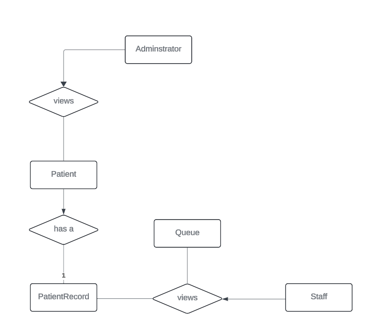
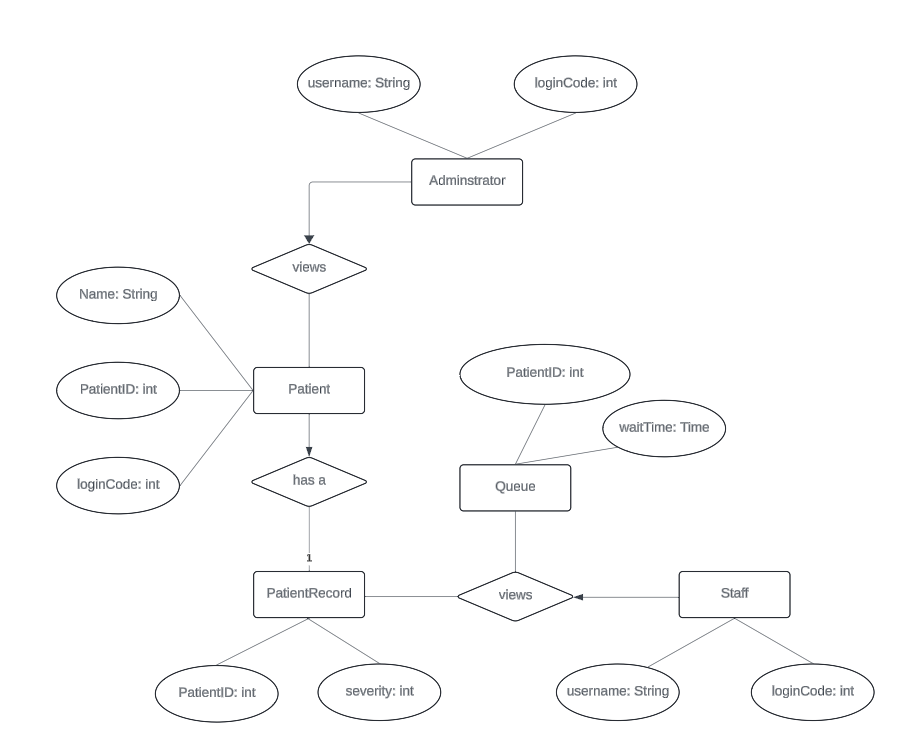

# Database Entities

For this web application, the following entities/records will be needed to store data in the database.

- Administrator 
- Patient
- Staff
- PatientRecord
- Queue

## Database Schema

The ER diagram containing the entity relationships can be viewed on Lucidchart by visiting this link: 
[ER Diagram](https://lucid.app/lucidchart/5d04e5b3-cecc-4776-850c-1778fdd195a9/edit?view_items=TzMVqalM4fQd&invitationId=inv_079cfb30-b7e6-4fee-955a-075c4d108930)

- ER Diagram showing relationships

- ER Diagram showing attributes

